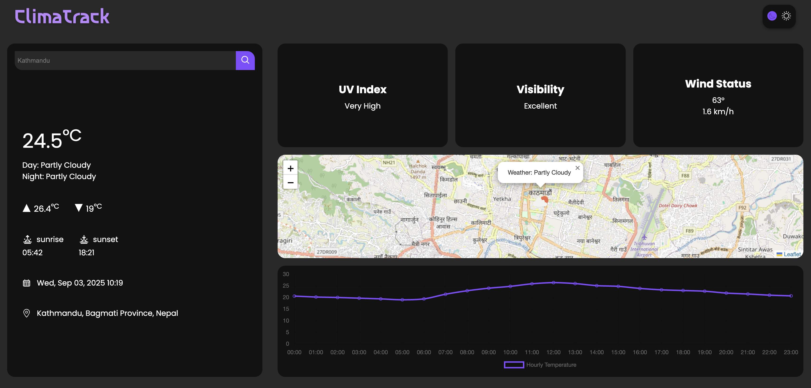

# ClimaTrack
## A Weather Dashboard

This is a fully functional weather dashboard built with vanilla HTML, CSS, and JS that allows you to search for your desired location, and when you press that search button, you will instantly see the temperature and other weather details.

**Live Demo:** [weather-dashboard](https://worldweather-dashboard.vercel.app)

---

## Preview 

---

## Features
    1. Search for weather info. by location
    2. Real-time temperature and condition details
    3. Responsive design for mobile and desktop
    4. Built with vanilla JS (no frameworks)

---

## Tech Stack
    1. **HTML5**
    2. **CSS3**
    3. **JavaScript (ES6)**
    4. [Open-Meteo](https://open-meteo.com/) - Weather API 
    5. [TimeAPI](https://timeapi.io) - Time data
